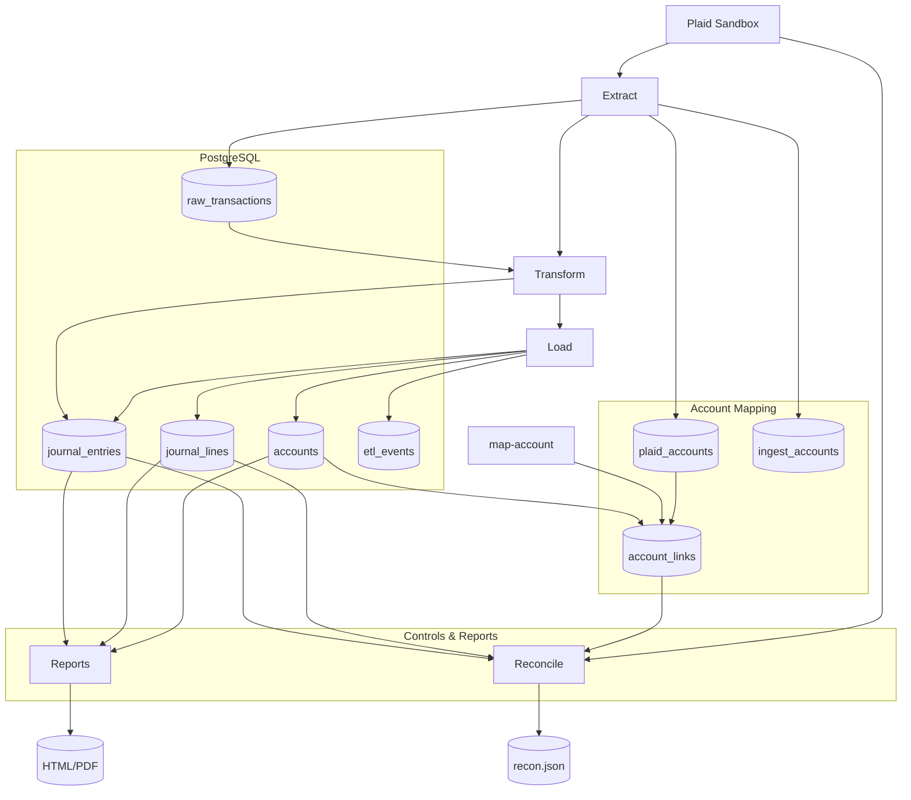
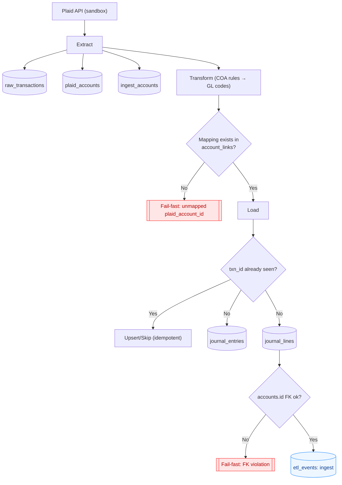
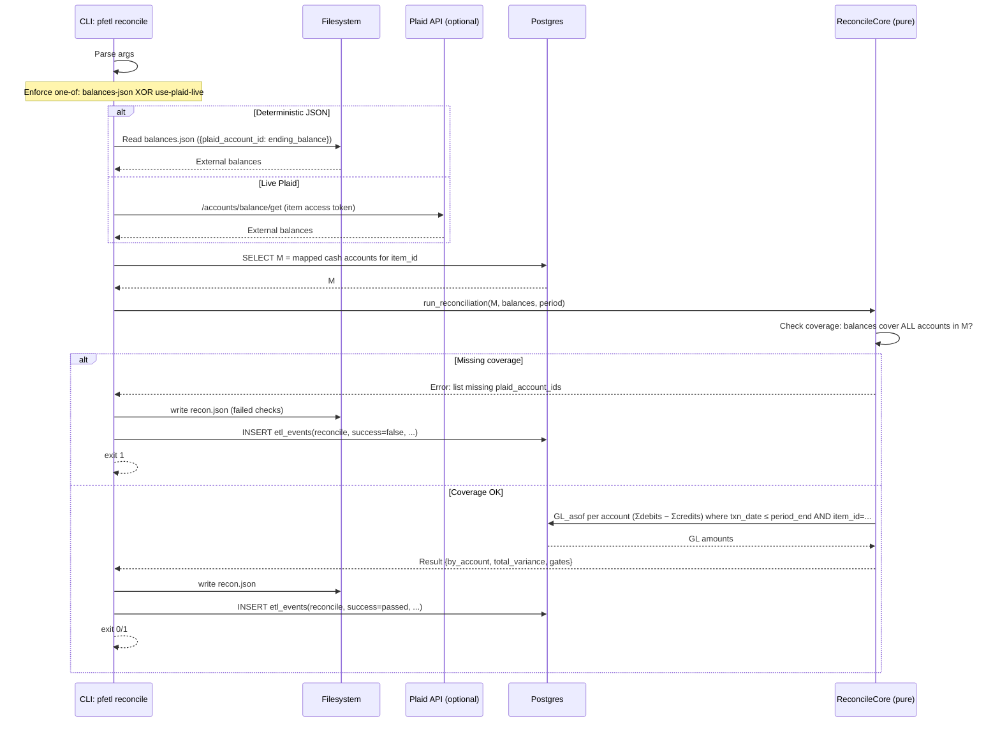

# Architecture

PFETL is a small, auditable ETL with MVP architecture:

1. **Extract** Plaid sandbox data (pagination, retry, optional raw landing)
2. **Transform** Plaid transactions into **balanced double-entry** journal entries
3. **Load** into Postgres with **FK integrity**, **idempotency**, and **ETL events**
4. **Reconcile** period results against Plaid balances with strict gates
5. **Report** deterministic HTML (+ PDF existence)

*Note: Raw transaction landing provides audit lineage - compacted JSON stored with `source_hash = SHA256(compact JSON)` carried forward to journal entries for traceability.*

### 1) Ledger (ETL + Canonical GL + Idempotency)

**What this highlights (for reviewers):** explicit mapping, FK-enforced ledger, duplicate protection via `txn_id`, and fail-fast philosophy.

---

### 2) Reconcile (AS-OF Ending Balance, Coverage, Item Scoping)

*Drop a one-line caption right below:*
**Formula:** `GL_asof = Σ(debits) − Σ(credits)` over **mapped `is_cash=TRUE`** accounts with `txn_date ≤ period_end`, filtered by `item_id`.

## Key properties

* **Pagination & Retry:** bounded attempts on 429/5xx with jittered backoff.
* **Determinism:** stable ordering; canonicalized JSON hashing for `source_hash`.
* **Idempotency:**

  * Entries deduped by `txn_id`.
  * Plaid accounts cached in `ingest_accounts` (staging), **canonical** metadata in `plaid_accounts`.
* **Canonical GL & FKs:**

  * `journal_lines.account_id → accounts.id` (FK enforced).
  * **Mappings** via `account_links` (Plaid → GL 1:1).
  * **Fail fast** on unmapped GL codes, with `PFETL_AUTO_CREATE_ACCOUNTS` hint (auto-create intentionally disabled in MVP).
* **Lineage (gate):** `source_hash` (SHA256 of compact raw JSON) and positive `transform_version` **required** on all entries, with optional `raw_transactions` audit trail.
* **Reconciliation gates (period-filtered by `txn_date`, inclusive):**

  * All entries balanced (`∑debits == ∑credits`).
  * Cash variance across **mapped cash accounts** ≤ **0.01** vs Plaid balances.
  * Missing lineage count must be zero.
  * Any breach → non-zero exit.
* **Reports:** Deterministic HTML (`bs_2024Q1.html`, `cf_2024Q1.html`) with graceful PDF fallback when WeasyPrint unavailable.
* **CLI Interface:** `init-db`, `onboard`, `ingest`, `map-account`, `reconcile`, `report`. Sandbox-only onboarding in MVP.
* **Dual Population:** `ingest` populates both `ingest_accounts` (item-scoped mapping with composite PK) and `plaid_accounts` (canonical) for backward compatibility.
* **Item-Scoped Accounts:** `ingest_accounts` uses composite PRIMARY KEY (item_id, plaid_account_id) to enable multi-item management and prevent account ID collisions.
* **Account Mapping:** User-driven via `map-account` CLI command creates explicit `account_links` for audit-ready reconciliation.
