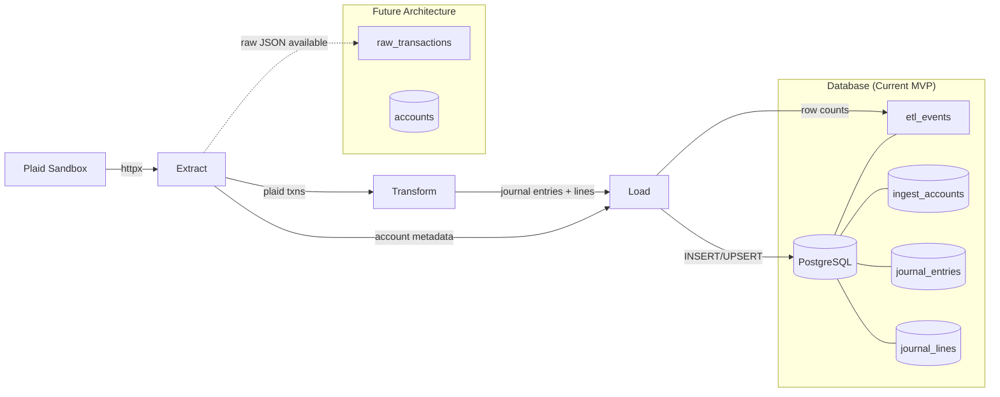

# Architecture

PFETL is a small, auditable ETL with MVP architecture:
1) **Extract** from Plaid sandbox (pagination, retry)
2) **Transform** → balanced double-entry (bypasses raw landing for MVP)
3) **Load** → Postgres with idempotency + ETL events

*Note: Raw transaction landing is available but not used in current CLI workflow.*

## Key properties

* **Pagination & Retry:** bounded attempts on 429/5xx with jittered backoff
* **Determinism:** stable ordering `(posted_date, txn_id)`; canonical JSON hashing
* **Idempotency:** dedupe by `txn_id`; account upsert by `plaid_account_id` in `ingest_accounts`
* **Chart of Accounts:** YAML-based mapping from Plaid types to GL account names
* **CLI Interface:** `init-db`, `onboard`, `ingest` commands with sandbox-only operation
* **Shim Tables:** Uses `ingest_accounts` for MVP, bypassing full GL constraints